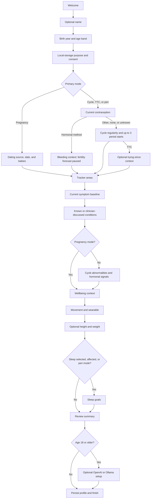
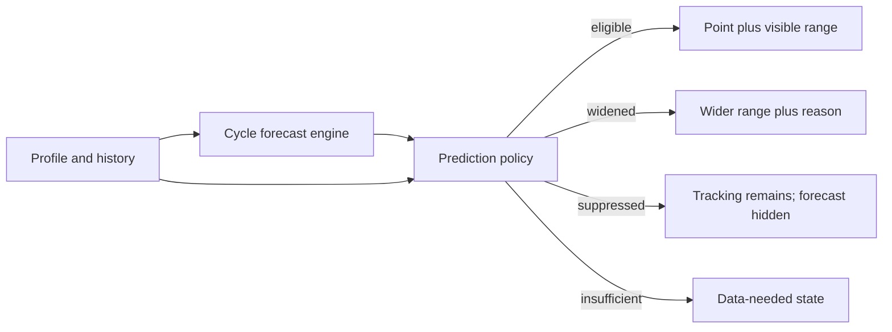

# Adaptive onboarding architecture

Updated: 2026-07-26

## Purpose

Onboarding is the first health-data ingestion workflow. Its job is not to copy
52 screenshots or maximize question count. It must gather the minimum
goal-relevant context needed to:

- choose a cycle, TTC, pregnancy, or perimenopause mode;
- determine which forecasts are eligible, suppressed, or intentionally wide;
- initialize typed logging and relevant shortcuts;
- preserve unknown, approximate, skipped, and prefer-not-to-answer states;
- explain sensitive-data purpose before collection;
- create an editable, versioned local profile;
- avoid turning self-reported context into a diagnosis.

The resulting flow is **adaptive depth**: shared privacy-critical questions are
always present; medically irrelevant modules are removed; optional lifestyle
and sensitive questions remain skippable.

## Runtime state machine

`Onboarding.tsx` constructs the step queue from the current draft. The queue is
recalculated when a branching answer changes.



Changing an earlier branch must never silently retain incompatible claims. For
example:

- selecting pregnancy removes cycle/fertile predictions;
- selecting a hormonal method routes to bleeding tracking instead of natural
  cycle history;
- deselecting sleep and reporting no sleep impact removes the separate sleep
  goals module unless perimenopause mode requires it;
- an under-18 profile never receives the optional assistant setup step.

## Shared profile and time-series separation

The data model separates durable context from dated observations:

```text
HealthProfile v2
├── identity: display name, birth year, age band
├── goals: selected/primary mode
├── cycle baseline: regularity, history, confidence, usual lengths, flags
├── reproductive context: contraception, TTC date, pregnancy dating
├── known health context
├── wellbeing preferences
├── optional biometrics
├── native permission states
└── versioned consent ledger

DailyLog
├── explicit complete-check-in marker
├── bleeding, symptoms and severity/impact
├── mood, discharge, intimacy, digestion
├── pregnancy/ovulation tests
├── activity and lifestyle
├── BBT, sleep, steps, water and weight
└── notes
```

Onboarding may seed true dated observations—for example, entered period starts.
It must not convert a generic preference or condition answer into a historical
event. A pregnancy dating input retains its actual source instead of being
silently rewritten as LMP.

## Question contract

Every onboarding field should have a contract:

| Contract item | Requirement |
|---|---|
| Purpose | Reader-facing explanation of why the question is asked |
| Type | Explicit enum, numeric range, date, array, or free text |
| Optionality | Required, skippable, unknown, approximate, or prefer not to answer |
| Branch effect | Steps added, removed, or changed |
| Forecast effect | Enables, suppresses, widens, or has no effect |
| Tracker effect | Category visibility, shortcut, or reminder eligibility |
| Privacy class | Local profile, sensitive health, external AI, native health import |
| Persistence | Versioned profile field or dated `DailyLog` field |
| Edit consequence | Which forecasts/reports must be recomputed |
| Safety limit | Non-diagnostic wording and any care-routing behavior |

This makes the flow auditable and prevents “personalization” questions that do
not have a legitimate downstream use.

## Current branching rules

| Input | Current behavior | Important limitation |
|---|---|---|
| Birth year | Requires age 13+, assigns 13–15, 16–17, or adult band; hides AI for minors | Region-aware age policy is not complete |
| Local storage consent | Required before health answers are persisted | Export/delete are implemented later in Settings; consent amendment UI remains limited |
| Primary mode | Selects cycle, TTC, pregnancy, or peri path | Multi-goal precedence and simultaneous modes are not modeled |
| Hormonal contraception | Skips natural-cycle history and shows forecast-paused explanation | First-class regimen history is still missing |
| Pregnancy | Collects date method, date, and number of babies | Prior-pregnancy, loss, postpartum, appointment, and lifestyle branches remain |
| TTC | Adds optional trying-since question and fertility-evidence education | Test protocol, recent contraception discontinuation, and prenatal-vitamin plan remain |
| Tracking areas | Personalizes tracker intent and conditional sexual/sleep questions | Does not yet create a complete per-user tracker layout migration |
| Sleep selection/impact/peri | Adds sleep-goals module | Wearable permission is still a later Settings/native flow |
| Adult assistant opt-in | Offers OpenAI BYO key or Ollama | Provider policy, network availability, and clinical evaluation remain separate |

## Cycle-history semantics

The cycle-history step accepts up to three real period starts, plus:

- regular, irregular, or unsure;
- known, approximate, or unknown date confidence;
- usual cycle length;
- usual bleeding duration.

Rules:

1. A blank date is missing data, not a zero or “no period.”
2. Spotting must not be seeded as a period start.
3. The forecast engine may use the stated baseline before enough completed
   cycles exist, but must label that evidence mode.
4. Completed logged cycles supersede a generic baseline.
5. Irregularity and relevant context widen the display range; they do not
   diagnose a cause.
6. Editing or deleting a period start invalidates affected cycle day,
   forecast, phase report, and pattern output.

## Pregnancy dating contract

Supported input methods:

- clinician-assigned estimated due date;
- first day of last menstrual period;
- conception date;
- day-3 embryo transfer;
- day-5 embryo transfer.

The stored pregnancy record includes:

- input method and input date;
- calculated or assigned EDD;
- normalized gestational start used for display;
- authority: clinician assigned, ART derived, or user estimated;
- provisional status;
- update timestamp;
- number of babies.

A clinician-assigned EDD is authoritative. Other calculations remain
provisional and must be editable. The current model does not yet retain a full
change history, which is required before release.

## Consent and privacy architecture

The versioned consent ledger currently supports:

- local health storage;
- assistant sharing;
- health import;
- notifications.

Consent purposes are independent. Agreeing to local storage does not grant
assistant sharing, HealthKit/Health Connect access, notification permission, or
backup. Operating-system permissions remain just in time and revocable.

The onboarding promise must remain technically accurate:

- core profile and logs stay local;
- no account is created;
- AI is optional;
- health import is optional;
- backup is optional and client encrypted.

The present Dexie database is local but not a substitute for encrypted native
storage at rest. The encrypted-native-database migration is tracked as a P0
release item.

## Prediction eligibility output

Onboarding produces a display policy, not only raw calculator inputs:



Examples:

- pregnancy suppresses period, ovulation, fertile-window, and cycle-day
  predictions;
- hormonal contraception suppresses ovulation/fertile-window prediction while
  retaining appropriate bleeding and adherence tracking;
- irregular cycles, PCOS context, and perimenopause widen uncertainty and show
  why;
- OPK and BBT add explicitly limited evidence labels;
- calendar estimates always retain the warning that they are not confirmation
  or birth control.

## Review and persistence transaction

Before finishing, the summary groups answers by:

- forecast baseline;
- prediction eligibility;
- tracking focus;
- conditions and reported signals;
- optional wellbeing/biometric context;
- missing information.

Completion writes:

1. the normalized `HealthProfile` v2 record;
2. compatibility settings needed by older screens;
3. valid entered period starts as dated flow logs;
4. an API key only to the native secret vault when the adult user explicitly
   configures one;
5. the onboarding-complete flag last.

Writing the completion flag last prevents an interrupted save from appearing
as a completed setup.

## UI architecture

The UI uses an original Periodus design system:

- chapter banners and an original moon/seed character;
- clear progress and back/skip behavior;
- option cards that reveal the consequence of a selection;
- compact chip grids for multi-select taxonomies;
- “why we ask” and safety cards;
- visual forecast-paused states;
- review summary before persistence.

The design may learn from the observed hierarchy and interaction quality, but
must not reproduce Flo branding, illustrations, copy, iconography, or trade
dress.

## Validation matrix

Automated and browser/device coverage should include:

- each primary goal;
- hormonal and non-hormonal contraception;
- known, approximate, and unknown cycle dates;
- one, two, and three entered period starts;
- irregular, PCOS-context, and perimenopause uncertainty;
- every pregnancy dating source and singleton/multiple selection;
- skipped sensitive questions and prefer-not-to-answer;
- age 13, 15, 16, 17, 18, and regional boundaries;
- changing an earlier answer after later steps are populated;
- interrupted persistence and migration from profile v1;
- screen reader, keyboard, dynamic type, reduced motion, and small screens;
- no network, denied native permissions, and assistant provider failure.

## Remaining architecture gaps

1. Region-aware age and consent policy.
2. Multi-goal precedence and mode-transition history.
3. Dated contraception and medication regimen history.
4. Full pregnancy history, pregnancy-loss-safe transitions, postpartum, and
   appointment/test modules.
5. Deeper TTC protocol and reminder preferences.
6. Perimenopause surgery, hormone-therapy, and last-bleed context.
7. Permission denial/retry/revocation screens in the onboarding graph.
8. Answer change history and reasoned forecast invalidation log.
9. Encrypted native persistence and migration.
10. Clinical, privacy, accessibility, and localization review.
