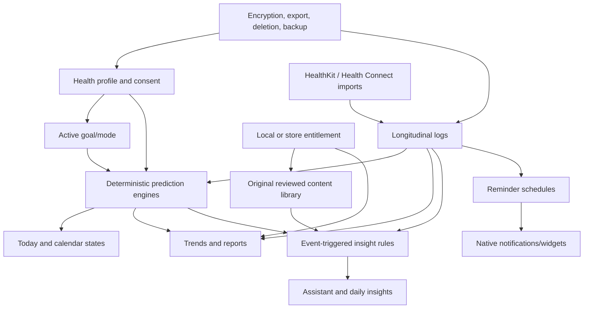

# Beyond the 52 Screens: Flo Capability and Local-Feasibility Audit

Updated: 2026-07-26

## Executive verdict

The 52 supplied screenshots are valuable reference evidence, but they are not a complete specification of Flo. They capture one iOS onboarding path, several tracker sheets, a subscription screen, and a few Today states. Flo is a stateful health product whose visible screens change with:

- the user's goal: cycle tracking, trying to conceive, pregnancy, or perimenopause;
- age, cycle history, cycle regularity, contraception, conditions, symptoms, and permissions;
- subscription entitlement, platform, locale, experiments, and time;
- accumulated longitudinal logs, pregnancy week, cycle phase, or event triggers.

Periodus now has meaningful foundations—adaptive onboarding, local cycle/TTC/pregnancy/perimenopause engines, an extensive tracker taxonomy, reports, native shells, health bridges, notifications, and an optional AI assistant—but it does **not** yet have full behavioral parity. The largest remaining gaps are not cosmetic. They are:

1. missing onboarding branches and permission/privacy states;
2. incomplete structured logging and reminder models;
3. incomplete longitudinal analytics and event-triggered insights;
4. incomplete pregnancy and perimenopause experiences;
5. no production subscription/entitlement layer;
6. no bundled multimedia/editorial system;
7. no encrypted native database at rest;
8. no clinically governed assistant content/evaluation program;
9. no account, cloud restore, or Anonymous Mode identity architecture.

Exact Flo parity is also not a legitimate or technically obtainable target in several areas. Flo's prediction weights, training data, calibration, Perimenopause Score, private medical content corpus, experiments, and proprietary art/assets are not public. Periodus can build independent equivalents based on public medical guidance and transparent local algorithms, but cannot truthfully claim to reproduce Flo's internal models or medical validation.

## Evidence labels

This audit distinguishes evidence instead of treating every screenshot or marketing statement as proof of implementation detail.

- **Official observed**: described by a current Flo Help Center, Flo product, App Store/Google Play, platform, or privacy page.
- **Screenshot observed**: directly visible in the 52 user-supplied screenshots.
- **Repository observed**: present in the Periodus repository as of the update date.
- **Inference**: a likely product requirement inferred from public behavior; not claimed as a verified Flo implementation.
- **Proprietary/unknown**: cannot be recovered from screens or public documentation.

## Scope

The requested product scope includes the AI assistant and broad cycle, TTC, pregnancy, perimenopause, logging, reporting, privacy, local-first, and native-platform capabilities.

Per the current project decisions in [FEATURE_PARITY.md](./FEATURE_PARITY.md), these Flo areas remain intentionally excluded:

- Secret Chats/community;
- partner sharing/Flo for Partners;
- symptom checker;
- Guided Journey.

They appear in this audit only where they affect navigation, entitlement, privacy, or completeness. They are not added to the implementation backlog.

## What the screenshots do and do not prove

The screenshots prove a particular sequence and several visual states:

- name and birth-year collection;
- multi-goal selection;
- cycle regularity and last-period capture;
- contraception and health-condition questions;
- symptom, cycle-abnormality, hormonal-signal, mental-health, sexual-wellbeing, activity, wearable, height, weight, and sleep questions;
- interstitial analysis/progress states;
- a paywall;
- Today states for no period history, period days, follicular/fertile days, and ovulation;
- a large tracker sheet with mood, symptoms, discharge, sex, medications, water, weight, basal temperature, tests, lifestyle, and exercise;
- an assistant prompt.

They do **not** prove:

- every branch produced by different answers;
- every goal-specific onboarding;
- how missing or conflicting data is reconciled;
- how predictions are calculated or calibrated;
- how reminders are scheduled and rescheduled;
- how reports, exports, deletion, sync, restore, or entitlements work;
- the full editorial library or assistant decision tree;
- Android variants, accessibility states, localization, errors, offline states, or experiments;
- all premium features or feature availability by region;
- clinical validation or medical equivalence.

The correct implementation strategy is therefore a behavioral state matrix, not a collection of 52 isolated replicas.

## Product topology beyond the supplied screens

Official Flo documentation describes a broader topology:

- setup includes permissions, goal selection, birth year, feature introduction, registration, personalized onboarding, and period logging ([Setting up your Flo account](https://help.flo.health/hc/en-us/articles/4406826484500-Setting-up-your-Flo-account));
- the tracker supports more than 80 signals and customizable categories ([How do I use the app?](https://help.flo.health/hc/en-us/articles/360014347632-How-do-I-use-the-app));
- the product includes Today, calendar/history, tracker, graphs and reports, editorial Insights, reminders, and an event-triggered Health Assistant;
- goal-specific experiences change the home state, predictions, content, and logs;
- free and premium entitlements materially change available analysis and content ([free version](https://help.flo.health/hc/en-us/articles/4411293934740-What-s-included-in-the-free-version), [Flo Premium](https://flo.health/flo-premium)).

Periodus should model these as independent domains connected by a shared health profile:

## Adaptive onboarding state machine

### Shared setup

Official Flo setup has seven broad stages: permissions, goal, birth year, feature introduction, registration, personalized onboarding, and period logging. It also says last-period data is essential and that additional completed cycles enable more sophisticated predictions ([official setup guide](https://help.flo.health/hc/en-us/articles/4406826484500-Setting-up-your-Flo-account)).

| Requirement | Evidence | Periodus status | Gap |
|---|---|---:|---|
| Name/display name | Screenshot observed | Present | Add accessibility, blank-name, and edit-later states |
| Birth year and age-sensitive experience | Screenshot + official observed | Partial | Repository accepts implausibly young ages; add region-aware minimum-age gate and age-change consequences |
| Multi-goal selection and primary mode | Screenshot observed | Present | Define deterministic precedence when multiple goals conflict |
| Registration or local-only decision | Official observed | Missing by design | Add an explicit “local-only” explanation; account is needed only if cloud restore is later introduced |
| Permission education and just-in-time requests | Official observed | Partial | Profile fields exist, but onboarding lacks complete OS permission and denial/retry states |
| Privacy/health-data consent | Privacy requirement | Missing | Add explicit sensitive-data purpose, local storage, AI-sharing, wearable import, deletion, and export choices |
| Last-period history or “I don't remember” | Screenshot + official observed | Partial | Add history confidence, unknown state, multiple-cycle import, and correction flow |
| Loading/analysis interstitials | Screenshot observed | Present visually in part | Tie them to actual persisted calculations; never imply proprietary “intelligence” |
| Summary and editable answers | Product requirement | Partial | Add a review screen grouped by data purpose and prediction effect |

The Flo setup guide lists a minimum age of 13 in most regions and 16 in the EU. Periodus needs a documented regional age policy before release; this is product/legal implementation work, not merely a numeric picker.

### Cycle-tracking branch

Expected inputs:

- last period start and optional end/flow;
- regularity, usual cycle length, usual period length, and confidence;
- previous cycle starts if available;
- contraceptive method;
- known conditions and cycle abnormalities;
- baseline symptoms and user priorities.

Periodus already captures most of these. Remaining work:

- request two to six historical cycle starts when available instead of relying on one date;
- distinguish “regular,” “variable,” “unknown,” postpartum, breastfeeding, amenorrhea, and hormonal-contraception contexts;
- explain when predictions are suppressed or widened;
- persist why a forecast changed after an edited log;
- add “I do not remember” and low-confidence states throughout.

Flo explicitly says the app is not intended as birth control or a conception method ([How do I use the app?](https://help.flo.health/hc/en-us/articles/360014347632-How-do-I-use-the-app)). Periodus should keep the same type of safety boundary and must not present a “low chance” day as “safe.”

### Trying-to-conceive branch

Official Flo material describes fertility-window guidance, ovulation-test and basal-temperature tracking, prenatal-vitamin reminders, pregnancy-test timing, and a doctor-facing health report ([Flo ovulation tracker](https://flo.health/product-tour/ovulation-tracker), [manual ovulation entry](https://help.flo.health/hc/en-us/articles/360015106752-Can-I-enter-my-ovulation-manually)).

Periodus currently has a deterministic TTC engine with qualitative fertility bands, OPK and BBT evidence, pregnancy-test planning, and logging counts. It still needs:

- TTC-specific onboarding for cycle history, trying-since date, recent hormonal-contraception discontinuation, known diagnoses, and test preferences;
- structured OPK values/results, test brand or method only when useful, and manual ovulation confirmation;
- a BBT measurement protocol and invalid-reading markers;
- cervical-mucus tracking with richer categories;
- prenatal-vitamin schedule/reminder;
- explicit late-period/test flow;
- clinician-friendly TTC summary;
- uncertainty language that separates predicted fertile window, positive OPK, retrospective BBT shift, and clinician-confirmed ovulation.

Numeric “chance of pregnancy” should not be fabricated from a generic calendar. A transparent qualitative band is safer unless Periodus later develops and validates an evidence-backed probability model.

### Pregnancy branch

Flo's pregnancy onboarding can derive gestational age from last menstrual period, estimated due date, or conception date; it asks lifestyle and prior-pregnancy questions. Pregnancy mode includes gestational age, due date, number of babies, weekly development, stories, articles, videos, and courses ([pregnant-user setup](https://help.flo.health/hc/en-us/articles/4407228824340-Getting-started-for-pregnant-users), [pregnancy mode](https://help.flo.health/hc/en-us/articles/360054523711-What-is-Pregnancy-mode-and-how-do-I-activate-it), [pregnancy product tour](https://flo.health/product-tour/pregnancy-app)).

Periodus currently supports LMP-derived gestational age, a due date, weekly detail, checklists, FAQs, and urgent-warning text. Gaps:

- allow LMP, due-date, conception-date, IVF transfer, and clinician-adjusted dating inputs;
- track which date source is authoritative and preserve change history;
- support singleton/multiple pregnancy;
- collect optional previous-pregnancy, pregnancy-loss, and lifestyle context with “prefer not to answer”;
- add pregnancy-specific logs and red-flag routing;
- add appointments, tests, medications/supplements, weight, movement, and symptom timelines;
- add week-by-week original content and partner-independent checklists;
- add postpartum transition and pregnancy-loss-safe mode switching;
- avoid presenting a calculation as a diagnosis or replacing prenatal care.

Flo's public pages contain some marketing inconsistencies about duration. Periodus should use authoritative obstetric guidance and a single internal gestational-age convention rather than reproducing marketing copy.

### Perimenopause branch

Flo publicly describes a perimenopause experience with a “Perimenopause Score,” a next-period window instead of an exact prediction, hot-flash/mood/fatigue/sleep tracking, daily tips, milestones, trends, reports, and expert content ([Flo perimenopause announcement](https://flo.health/newsroom/flo-for-perimenopause-is-launching-to-empower-the-1-billion-women-who-experience-perimenopause-without-the-support-they-deserve)).

Periodus has an original, non-diagnostic tracking-burden score, 28-day windows, symptom domains, trends, and observations. That is an appropriate independent direction. Gaps:

- dedicated onboarding for age range, changing cycle pattern, last bleed, vasomotor symptoms, sleep, mood, genitourinary symptoms, contraception, hysterectomy/oophorectomy, and hormone therapy;
- no-exact-date forecast mode with explicit widening windows;
- 60-day/90-day/annual trend reports;
- transition logic when bleeding is absent or medically induced;
- perimenopause-specific content and clinician discussion prompts;
- careful terminology: do not label the original Periodus score as Flo's validated score or a menopause stage diagnosis.

Flo's exact score formula, thresholds, validation data, and calibration are proprietary/unknown and cannot be recreated from public screens.

### Contraception branch

Flo supports pills, ring, patch, injection, IUD, and implant logging/reminders. Oral contraception can distinguish on-time and previous-day pills and configure pack length/break behavior. Turning on hormonal-contraception reminders hides fertile and ovulation predictions; copper IUD behavior differs ([official contraception guide](https://help.flo.health/hc/en-us/articles/360015106292-How-do-I-log-my-birth-control-method), [prediction behavior](https://help.flo.health/hc/en-us/articles/360015106672-Why-can-t-I-see-ovulation-predictions)).

Periodus has a broad contraception question and already suppresses some forecasts. It still needs a first-class regimen model:

- method, start/stop dates, dose or product label when entered by the user;
- pill pack configuration, placebo/break schedule, missed/late dose, and “yesterday's pill” correction;
- ring/patch change schedule;
- injection renewal date;
- implant/IUD insertion and optional replacement date;
- method-specific reminders and safe prediction suppression;
- historical regimen changes so old logs are interpreted correctly;
- “no emergency contraception tracking” unless separately designed and reviewed.

### Discharge, sexual wellbeing, and sensitive questions

The screenshots reveal a much richer discharge and sexual-health taxonomy than Periodus's current typed model. The existing `DailyLog` has a narrow discharge enum and a narrow sex enum even though some additional concepts appear as generic events.

Required structured additions:

- discharge: none, watery, creamy, sticky, egg-white, spotting, unusual, clumpy white, gray, and user note;
- sex: no sex, protected, unprotected, oral, anal, masturbation, sensual touch, toys, orgasm, sex-drive level, and optional pain/bleeding;
- pregnancy and ovulation tests with date, result, and optional note;
- privacy-sensitive defaults, clear “prefer not to answer,” and local deletion;
- insight rules that never infer identity, consent, STI status, pregnancy, or diagnosis from a log.

Generic event tags are insufficient where downstream logic depends on semantics, reminders, risk messaging, or trend reporting.

### Weight, activity, sleep, and wearables

Periodus captures height, weight, activity, wearable brand, sleep impact, and goals, but onboarding currently needs:

- locale-aware units with canonical metric storage;
- “skip/prefer not to answer” without degrading core cycle tracking;
- measurement date/source and edit history;
- separation of self-entered values from wearable-imported values;
- optional activity, sleep, and weight goals without implying that height or weight necessarily improves an individual cycle forecast;
- wearable permission education only after the user selects a relevant feature.

## Internal app information architecture

### Today and calendar

Flo's Today surface is not one screen. It is a renderer over mode, date, phase, history completeness, pregnancy week, forecast certainty, and log state.

Periodus should define explicit state contracts for:

- no usable period history;
- current period day;
- predicted period;
- early/mid/late follicular phase;
- fertile-window day;
- predicted ovulation day;
- luteal phase;
- late period;
- hormonal-contraception forecast suppression;
- irregular or perimenopausal window;
- TTC-specific testing state;
- pregnancy week/day;
- selected past or future date;
- insufficient/contradictory data;
- recalculating after an edit.

Each state needs:

- headline and confidence/uncertainty;
- calendar markings and legend;
- context-appropriate quick actions;
- daily insight ordering;
- explanation of what data changed the state;
- accessibility and reduced-motion behavior.

### Tracker

The tracker should become a schema-driven subsystem rather than a static modal. Required capabilities:

- category registry and stable signal identifiers;
- signal type: boolean, enum, count, duration, time, quantity, text, or test result;
- category customization and ordering;
- search and synonyms;
- provenance: manual, HealthKit, Health Connect, calculated, or imported;
- edit/delete with recalculation;
- mutual exclusions and validation;
- reminder bindings;
- privacy classification;
- downstream engine and report bindings;
- migration when taxonomy changes.

The current more-than-80-signal catalog is a strong base, but many signals still need typed persistence and downstream behavior.

### Graphs, trends, and reports

Flo describes cycle dates/durations/averages, comparison with a previous cycle, a six-cycle chart, event patterns, and a doctor report that can be shared or printed on supported platforms ([official cycle analysis guide](https://help.flo.health/hc/en-us/articles/4407228784276-Analyzing-your-cycles-and-symptoms)).

Periodus has cycle statistics and an initial printable doctor summary. Gaps:

- six- and twelve-cycle trend views;
- cycle-length variability and confidence;
- period-length and flow trends;
- symptom frequency by cycle phase;
- user-selected two-signal correlation explorer with sample size and caveats;
- medication/contraception era annotations;
- BBT and OPK charts;
- pregnancy, TTC, and perimenopause-specific reports;
- native PDF generation/share sheet, not browser print only;
- inclusion/exclusion controls for sensitive signals;
- report methodology, date range, data completeness, and non-diagnostic disclaimer.

No pattern should be called causal. Small samples should be labeled as observations, not predictions.

### Insights, articles, audio, video, and courses

Flo's Insights area includes articles, insights, videos, courses, surveys, stories, search, bookmarks, and goal/topic filtering ([official Insights guide](https://help.flo.health/hc/en-us/articles/360061400651-What-is-Insights-and-how-do-I-navigate-there)). Premium marketing also lists articles, videos, and audio ([Flo Premium](https://flo.health/flo-premium)).

Periodus currently has article search but no full editorial/media system. A complete local implementation needs:

- an original, licensed, versioned content corpus;
- medical-review metadata: author, reviewer, review date, citations, jurisdiction, and next review date;
- topic, goal, mode, age, cycle phase, pregnancy week, and symptom tags;
- offline text/audio packages and download management;
- bookmarks, progress, history, and search;
- accessible transcript/captions;
- content invalidation and migration when safety guidance changes;
- rules connecting a log/phase to appropriate content;
- editorial admin workflow, even if content ships statically.

Flo's private copy, videos, audio, courses, illustrations, mascot, and animations are proprietary assets. Periodus needs an original design language and original reviewed content rather than redistributing or tracing them.

### Messages and event-triggered assistant

Flo describes its Health Assistant as an interactive educational dialogue launched from topics/prompts or events and cycle phases. Some prompts expire after a changed signal or after 24 hours, and the content is medically checked. Flo says it is not a substitute for diagnosis or treatment ([official Health Assistant guide](https://help.flo.health/hc/en-us/articles/360052676191-How-do-I-chat-with-Flo-Health-Assistant-)).

Periodus's assistant foundation includes:

- explicit sharing categories;
- BYO OpenAI key stored in the native secure vault;
- `store:false` API behavior;
- optional Ollama;
- deterministic urgent-risk interception;
- ephemeral in-memory chat.

Remaining gaps:

- a first-class message/topic model with created, read, dismissed, expired, and invalidated states;
- deterministic event rules for new cycle, late period, positive test, symptom cluster, pregnancy week, and logged medication;
- original medically reviewed structured dialogues;
- retrieval only from the reviewed corpus for medical education;
- visible source links and “why am I seeing this?”;
- conversation deletion and retention controls;
- red-team and clinical safety evaluations across pregnancy, bleeding, self-harm, pain, medication, and minors;
- locale-appropriate urgent-care and crisis routing;
- prompt-injection and data-exfiltration defenses;
- rate, latency, offline, quota, and model-unavailable states;
- strict separation between deterministic calculations and generative explanation;
- no diagnostic conclusion, false certainty, or fabricated citation.

The assistant can be useful locally, but “AI parity” is not achieved by connecting a model. Flo's private dialogue corpus, reasoning rules, evaluations, and medical-governance process are not public.

## Reminders and notifications

Flo exposes cycle, medication, contraception, lifestyle, content, offer, and community-related notification categories, with some platform differences ([official notification settings](https://help.flo.health/hc/en-us/articles/360052675411-How-do-I-turn-off-notifications-from-Flo)).

Periodus currently has a generic daily local reminder. Required schedule model:

- period approaching, period late, log-period, fertile-window/ovulation estimate, and pregnancy-week reminders;
- pill, ring, patch, injection, implant/IUD follow-up, prenatal vitamin, and other medication schedules;
- water, sleep, weight, BBT, OPK, pregnancy test, movement, and journaling reminders;
- weekdays, recurrence, time zone, quiet hours, snooze, missed event, and completion state;
- per-reminder privacy-safe notification text;
- permission denied/provisional/quiet-delivery states;
- local rescheduling after time-zone or daylight-saving changes;
- in-app audit showing scheduled vs delivered vs completed where the OS permits.

Local notifications are buildable. Remote push campaigns, cross-device scheduling, and server-triggered delivery are not strictly local.

## HealthKit and Health Connect

Flo supports importing selected Apple Health and Health Connect data after OS permission. Its current documentation notes that permissions can be scoped and that some sources or indirect integrations may behave differently ([Apple Health import](https://help.flo.health/hc/en-us/articles/34890229122068-How-to-import-data-from-the-Health-app-to-Flo-iOS), [Health Connect pairing](https://help.flo.health/hc/en-us/articles/34890469974292-How-to-pair-Flo-with-Health-Connect-Android), [step tracking](https://help.flo.health/hc/en-us/articles/4401755925652-How-do-I-track-step-data-in-Flo)).

Periodus's native bridge currently imports menstrual flow, BBT, OPK, weight, sleep, and steps. Gaps:

- per-type permission UI and a source-of-truth policy;
- incremental background sync and deduplication;
- unit and time-zone normalization;
- source-device and manual-vs-imported provenance;
- conflict resolution and edit rules;
- revoked-permission handling;
- import range and deletion behavior;
- device-only QA on multiple OS versions;
- Health Connect declaration, Play Console health-app form, and minimum-data-access review.

HealthKit and Health Connect are native-device capabilities, not localhost browser features. They require a signed app, a physical or supported test device, entitlements/declarations, and user permission. See [Apple HealthKit](https://developer.apple.com/documentation/healthkit), [Health Connect overview](https://developer.android.com/health-and-fitness/health-connect), [Health Connect data types](https://developer.android.com/health-and-fitness/health-connect/data-types), and [Google Play health requirements](https://support.google.com/googleplay/android-developer/answer/14738291?hl=en).

## Privacy, export, deletion, backup, and identity

Flo's current privacy policy describes collection of cycle, reproductive, sexual, mental-health, pregnancy, perimenopause, sleep, weight, and wearable data; use for personalized content and predictions; access/deletion/portability rights; and limits on health-data advertising use ([Flo Privacy Policy, effective 2026-04-09](https://flo.health/privacy-Policy)).

Flo also offers:

- human-readable and machine-readable export, with export data distinct from a doctor report ([official export guide](https://help.flo.health/hc/en-us/articles/360054973811-How-do-I-get-a-copy-of-my-data));
- in-app account deletion ([official deletion guide](https://help.flo.health/hc/en-us/articles/360042567131-How-can-I-delete-my-account));
- account restore ([restore guide](https://help.flo.health/hc/en-us/articles/360015054351-How-can-I-sign-in-and-restore-my-data));
- an Anonymous Mode designed to decouple personal identifiers, with deliberate recovery/support limitations ([Anonymous Mode](https://flo.health/product-tour/anonymous-mode)).

Periodus already provides immediate local export, import, wipe, PIN/biometric gating, secure key storage, and an encrypted-backup foundation. Critical gaps:

- the primary Dexie database is not encrypted at rest;
- PIN currently gates UI access but is not equivalent to database encryption;
- no consent ledger or per-purpose data-sharing record;
- no documented retention, deletion, backup, crash-log, or analytics policy;
- no account/cloud restore architecture;
- no separate anonymous identity domain because the app is currently local-only;
- no audit for data leaks through logs, notifications, screenshots, clipboard, WebView cache, backups, or AI payloads;
- no native background-lock and screenshot-protection policy;
- no export schema/version documentation.

P0 should be an encrypted native SQLite data layer with migration and recovery tests. Local-first without encryption is not enough for this sensitivity level.

An account-free local app is already pseudonymous in a useful sense, but it is not equivalent to Flo Anonymous Mode. True cross-device anonymous identity separation and recovery requires a carefully designed backend, cryptographic identity, and support model.

## Subscriptions and entitlements

Flo Premium uses recurring weekly/monthly/yearly plans, platform billing, trials, restoration, and web subscriptions in some cases. Flo says payment credentials are handled by Apple, Google, or Stripe rather than stored by Flo ([trying Premium](https://help.flo.health/hc/en-us/articles/4407228743956-Trying-Flo-Premium), [restore access](https://help.flo.health/hc/en-us/articles/4651865803668-I-paid-for-a-subscription-but-I-can-t-access-Premium-features), [payment information](https://help.flo.health/hc/en-us/articles/360042626371-Where-do-you-store-my-payment-information)).

Periodus currently has no production entitlement model. Required if a paid tier is desired:

- product catalog and free/premium feature matrix;
- StoreKit 2 and Google Play Billing;
- purchase, pending, deferred, canceled, grace, paused, refunded, expired, and restored states;
- local signed entitlement cache;
- receipt/transaction verification strategy;
- family-sharing policy if offered;
- trial eligibility and paywall experiment policy;
- privacy-safe analytics;
- “continue with free/local version” path;
- test-store automation and accessibility.

Real App Store/Play billing cannot be fully hosted or exercised offline. A local fake entitlement provider is buildable for development, but it is not production billing.

## Capability ledger

Status meanings:

- **Working**: functional in the current repository.
- **Foundation**: meaningful code exists but parity/release work remains.
- **Missing**: no complete implementation.
- **Excluded**: intentionally out of project scope.
- **External**: depends on platform/service/account.
- **Proprietary**: exact parity is unobtainable from public evidence.

| Capability | Current Periodus status | Local feasibility | Priority |
|---|---:|---:|---:|
| Adaptive shared onboarding | Foundation | Fully local | P0 |
| Region-aware age gate | Missing | Fully local | P0 |
| Cycle-history/confidence onboarding | Foundation | Fully local | P0 |
| TTC onboarding and engine | Foundation | Fully local | P0/P1 |
| Pregnancy onboarding and engine | Foundation | Fully local | P0/P1 |
| Perimenopause experience | Foundation | Fully local, exact Flo score proprietary | P1 |
| Contraception regimen model | Missing/partial | Fully local | P0 |
| Rich typed tracker | Foundation | Fully local | P0 |
| Calendar/Today state matrix | Foundation | Fully local | P0 |
| Cycle predictions with uncertainty | Working/foundation | Fully local; exact Flo ML proprietary | P0 |
| Symptom-pattern analytics | Partial | Fully local | P1 |
| Future symptom prediction | Missing | Local model possible; clinical validation needed | P2 |
| Cycle/TTC/pregnancy/peri reports | Foundation | Fully local | P1 |
| Native PDF/share | Missing | Native local | P1 |
| Articles/search | Working/foundation | Fully local | P1 |
| Original audio/video/courses | Missing | Local if licensed/bundled | P2 |
| Event-triggered assistant topics | Missing/partial | Fully local rules | P1 |
| OpenAI assistant | Foundation | External network/API | P1 |
| Ollama assistant | Foundation | Local/LAN, often not on-phone | P1 |
| Clinically reviewed assistant corpus/evals | Missing | Buildable, requires expert governance | P0/P1 |
| Specialized reminders | Missing/partial | Native local | P0 |
| HealthKit/Health Connect | Foundation | Native device + platform permission | P1 |
| Widgets | Foundation | Native device | P2 |
| Plain/encrypted export and local wipe | Working/foundation | Fully local | P0 |
| Encrypted core database at rest | Missing | Fully local/native | P0 |
| Cloud sync/account restore | Missing | Requires backend | P3/optional |
| Anonymous cross-device account | Missing | Requires backend/cryptographic identity | P3/optional |
| Production subscriptions | Missing | External store services | P2 |
| Secret Chats/community | Excluded | Requires backend/moderation | — |
| Partner sharing | Excluded | Requires secure backend/transport | — |
| Symptom checker | Excluded | High clinical/regulatory burden | — |
| Guided Journey | Excluded | Content/product system | — |
| Exact Flo algorithms/content/assets | Proprietary | Not obtainable | Never |

## What is buildable locally

### Fully local and realistic

- adaptive onboarding and persisted health profile;
- transparent deterministic cycle, TTC, pregnancy, and perimenopause engines;
- uncertainty ranges and contraception/pregnancy suppression;
- rich tracker, search, customization, edits, and history;
- local graphs, correlations, doctor summaries, and native PDFs;
- local scheduled notifications;
- original bundled articles, audio, video, and courses;
- original rule-based assistant topics and retrieval over reviewed content;
- encrypted native database, PIN/biometric gate, exports, backups, and wipe;
- widgets and native share sheets;
- import from HealthKit/Health Connect after OS permission.

### Local but native-device dependent

- HealthKit and Health Connect;
- biometric authentication and hardware-backed key storage;
- widgets, background refresh, notification delivery, share sheets;
- StoreKit/Play Billing sandbox flows;
- platform accessibility, keyboard, safe-area, and lifecycle behavior.

These cannot be proven by the Vite localhost page alone.

### Local/LAN but not guaranteed on-phone

- Ollama or another local language model;
- large semantic search indices;
- high-quality speech synthesis or transcription;
- heavier forecasting models.

A Mac/PC on the same network can host them, but that is a separate runtime with availability, security, power, and latency constraints. “Local” must identify the actual machine.

### Requires an external service or account

- OpenAI-hosted models;
- App Store/Google Play purchase and receipt infrastructure;
- store publication, review, signing accounts, and production certificates;
- remote push campaigns;
- cloud sync, account restore, cross-device history, and web access;
- support-assisted account recovery;
- community, partner sharing, or cross-user features.

### Literally unobtainable as exact parity

- Flo's prediction model weights, training data, calibration, and live experiments;
- Flo's future-symptom model and proprietary correlations;
- Flo's Perimenopause Score formula and validation thresholds;
- Flo's private medical/editorial corpus and assistant decision trees;
- exact current UI across unobserved variants and experiments;
- copyrighted content, illustrations, animations, mascot, audio, video, and proprietary copy;
- an honest claim of medical equivalence without independent validation and governance.

## Prioritized implementation plan

### P0 — trustworthy core before more screens

1. **Encrypt the primary database**
   - Move health/log data from unencrypted Dexie storage to encrypted native SQLite.
   - Use hardware-backed key wrapping where available.
   - Test migration, interruption, wrong-key, backup, restore, and wipe.

2. **Complete the onboarding state machine**
   - Shared, cycle, TTC, pregnancy, perimenopause, and contraception branches.
   - Age gate, privacy/permission steps, low-confidence/unknown states, review/edit.
   - Persist branch/version so migrations are deterministic.

3. **Normalize the tracker schema**
   - Typed discharge, sexual wellbeing, contraception, medication, tests, BBT, sleep, activity, and notes.
   - Provenance, validation, privacy class, edit history, and downstream bindings.

4. **Create the Today/calendar state contract**
   - Enumerate all modes and uncertainty states.
   - Add “why this changed” and safe forecast language.

5. **Build specialized reminder scheduling**
   - Cycle, medication, contraception, TTC, pregnancy, and lifestyle schedules.
   - Quiet hours, time zones, permission denial, privacy-safe text.

6. **Define medical/editorial governance**
   - Source policy, reviewer metadata, review cadence, incident response, and assistant safety evaluation.

P0 acceptance criterion: a user can complete any supported goal branch, understand data use, log/edit core events, receive appropriately suppressed/uncertain forecasts, lock/export/delete encrypted data, and use the app offline without a false medical claim.

### P1 — longitudinal intelligence

1. Six/twelve-cycle graphs, variability, BBT/OPK charts, symptom-by-phase analysis.
2. Native doctor PDF/share with data-selection controls.
3. Complete TTC workflows and pregnancy dating inputs.
4. Full pregnancy week/checklist/log architecture.
5. Dedicated perimenopause forecast-window and trend experience.
6. HealthKit/Health Connect provenance, sync, conflict, and revocation handling.
7. Event-triggered assistant message lifecycle and reviewed retrieval corpus.
8. Original Insights taxonomy, bookmarks, and offline search.

P1 acceptance criterion: accumulated data materially changes reports, Today, reminders, and reviewed insights in an explainable and testable way.

### P2 — media, polish, and monetization

1. Original licensed audio/video/course packages with transcripts.
2. StoreKit/Play Billing and entitlement matrix if monetization is desired.
3. Widgets, background refresh, richer native share actions.
4. Locale/unit expansion, accessibility audit, reduced motion, dynamic type.
5. Carefully validated future-symptom observations, labeled as uncertain.

### P3 — optional service layer

- end-to-end encrypted cross-device sync;
- account restore;
- cryptographically separated anonymous accounts;
- remote push orchestration.

These should not block a strong local-first v1.

## Required test matrix

The screenshot set should become fixtures, not the whole QA plan.

Test dimensions:

- iOS and Android;
- phone sizes, tablet, portrait/landscape where supported;
- light/dark mode where supported;
- dynamic type/font scaling, screen reader, reduced motion, high contrast;
- English plus long-string and right-to-left pseudo-locales;
- no history, one cycle, three cycles, irregular cycles, pregnancy, TTC, peri, and hormonal contraception;
- denied/revoked health, notification, motion, biometric, and network permissions;
- offline, API failure, stale entitlement, changed time zone, DST, and device restart;
- malformed import, interrupted migration, wrong PIN, lost key, and partial backup;
- minors/age boundaries;
- urgent assistant scenarios and benign near-matches;
- empty, loading, error, invalidated, deleted, and contradictory-data states.

Every prediction/report test should assert:

- source data used;
- source data excluded;
- uncertainty or suppression reason;
- deterministic result;
- recalculation after edit/delete;
- no diagnosis or “safe sex” implication.

## Open evidence gaps and capture plan

The next Flo research pass should seek behavior, not just more static images:

1. Record complete onboarding for each primary goal with deliberately different answers.
2. Capture branch transitions after selecting:
   - irregular cycles;
   - hormonal contraception;
   - positive pregnancy status;
   - pregnancy due date vs LMP vs conception date;
   - perimenopause;
   - “I don't know” and “prefer not to answer.”
3. Record edit/back/skip behavior and whether earlier answers invalidate later steps.
4. Capture all Settings, privacy, export, deletion, restore, reminders, and notification screens.
5. Capture a populated account over multiple cycle phases and a late-period state.
6. Capture Graphs & Reports with at least three and six logged cycles.
7. Capture TTC with positive/negative OPK, BBT shift, and pregnancy-test timing.
8. Capture pregnancy by trimester, due-date edit, multiples, loss/exit flow where safely accessible.
9. Capture perimenopause onboarding, forecast windows, score explanation, and trend reports.
10. Capture every assistant topic state: new, opened, dismissed, expired, invalidated, and deleted.
11. Capture free vs premium locked/unlocked states on both platforms.
12. Compare Android navigation, tracker taxonomy, and permission UX.

No capture should include another person's private health information, credentials, payment data, or proprietary asset extraction. The output should be a behavior/state inventory and original Periodus design specification.

## Source register

### Flo product and help

- [Setting up your Flo account](https://help.flo.health/hc/en-us/articles/4406826484500-Setting-up-your-Flo-account)
- [How do I use the app?](https://help.flo.health/hc/en-us/articles/360014347632-How-do-I-use-the-app)
- [What's included in the free version?](https://help.flo.health/hc/en-us/articles/4411293934740-What-s-included-in-the-free-version)
- [Flo Premium](https://flo.health/flo-premium)
- [Analyzing cycles and symptoms](https://help.flo.health/hc/en-us/articles/4407228784276-Analyzing-your-cycles-and-symptoms)
- [Insights navigation](https://help.flo.health/hc/en-us/articles/360061400651-What-is-Insights-and-how-do-I-navigate-there)
- [Flo Health Assistant](https://help.flo.health/hc/en-us/articles/360052676191-How-do-I-chat-with-Flo-Health-Assistant-)
- [Ovulation tracker product tour](https://flo.health/product-tour/ovulation-tracker)
- [Manual ovulation entry](https://help.flo.health/hc/en-us/articles/360015106752-Can-I-enter-my-ovulation-manually)
- [Getting started for pregnant users](https://help.flo.health/hc/en-us/articles/4407228824340-Getting-started-for-pregnant-users)
- [Pregnancy mode](https://help.flo.health/hc/en-us/articles/360054523711-What-is-Pregnancy-mode-and-how-do-I-activate-it)
- [Pregnancy app product tour](https://flo.health/product-tour/pregnancy-app)
- [Pregnancy-week calculation](https://help.flo.health/hc/en-us/articles/360015114272-How-does-Flo-calculate-the-week-of-pregnancy)
- [Flo for perimenopause announcement](https://flo.health/newsroom/flo-for-perimenopause-is-launching-to-empower-the-1-billion-women-who-experience-perimenopause-without-the-support-they-deserve)
- [Birth-control logging](https://help.flo.health/hc/en-us/articles/360015106292-How-do-I-log-my-birth-control-method)
- [Ovulation prediction suppression](https://help.flo.health/hc/en-us/articles/360015106672-Why-can-t-I-see-ovulation-predictions)
- [Notification settings](https://help.flo.health/hc/en-us/articles/360052675411-How-do-I-turn-off-notifications-from-Flo)
- [Apple Health import](https://help.flo.health/hc/en-us/articles/34890229122068-How-to-import-data-from-the-Health-app-to-Flo-iOS)
- [Health Connect pairing](https://help.flo.health/hc/en-us/articles/34890469974292-How-to-pair-Flo-with-Health-Connect-Android)
- [Step tracking](https://help.flo.health/hc/en-us/articles/4401755925652-How-do-I-track-step-data-in-Flo)
- [Flo Privacy Policy](https://flo.health/privacy-Policy)
- [Data export](https://help.flo.health/hc/en-us/articles/360054973811-How-do-I-get-a-copy-of-my-data)
- [Account deletion](https://help.flo.health/hc/en-us/articles/360042567131-How-can-I-delete-my-account)
- [Anonymous Mode](https://flo.health/product-tour/anonymous-mode)
- [Account restore](https://help.flo.health/hc/en-us/articles/360015054351-How-can-I-sign-in-and-restore-my-data)
- [Trying Flo Premium](https://help.flo.health/hc/en-us/articles/4407228743956-Trying-Flo-Premium)
- [Restoring Premium access](https://help.flo.health/hc/en-us/articles/4651865803668-I-paid-for-a-subscription-but-I-can-t-access-Premium-features)
- [Payment information](https://help.flo.health/hc/en-us/articles/360042626371-Where-do-you-store-my-payment-information)

### Platform sources

- [Apple HealthKit documentation](https://developer.apple.com/documentation/healthkit)
- [Android Health Connect](https://developer.android.com/health-and-fitness/health-connect)
- [Health Connect data types](https://developer.android.com/health-and-fitness/health-connect/data-types)
- [Google Play health-app requirements](https://support.google.com/googleplay/android-developer/answer/14738291?hl=en)

## Bottom line

The correct goal is not “draw the 52 screenshots.” It is:

> Build an original local-first reproductive-health product whose state model covers the observed flows, whose calculations are transparent and conservative, whose health data is encrypted and controllable, whose native integrations are real, and whose unobservable/proprietary areas are replaced by independently designed and honestly labeled equivalents.

That is buildable. Literal Flo equivalence—same private models, data, content, experiments, validation, assets, and cloud operations—is not.
