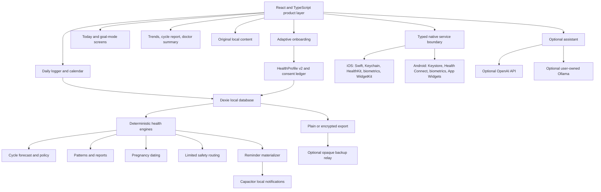

# Current progress and roadmap

Updated: 2026-07-26

## Bottom line

Lunara is now a substantial local-first native-app codebase, not a screenshot
prototype and not a PWA product plan. It has a shared React/TypeScript product
layer, Capacitor iOS and Android shells, a versioned health profile, adaptive
onboarding, a deep typed logger, transparent forecast engines, longitudinal
reports, pregnancy/TTC/perimenopause foundations, optional AI, and native
service bridges.

It is **not release-ready** and does **not do literally everything Flo does**.
The largest remaining risks are encrypted persistence, complete regimen and
reminder workflows, physical-device validation, medical/editorial governance,
accessibility/localization, and store release work. Flo's private models,
training data, validation, content, experiments, and assets are neither public
nor legitimate to copy.

The latest completed repository verification in this implementation pass was:

- TypeScript/Vite production build: passed;
- automated tests: 151/151 passed;
- fresh Capacitor sync: passed;
- unsigned iOS simulator Debug build: passed;
- Android Debug APK build and three native unit tests: passed;
- physical-device and signed-store validation: not complete.

## Architecture



Design principles:

- local profile and logs are the source of truth;
- durable profile context is separate from dated observations;
- calculators are separate from display-eligibility policy;
- reports expose methods, sample size, and missing-data limits;
- native services are narrow bridges, not scattered platform checks;
- every external transfer is optional and purpose scoped.

## What is implemented now

### Adaptive onboarding and profile

- Original Lunara onboarding UI with a goal-conditioned step queue.
- Cycle, TTC, pregnancy, and perimenopause primary modes.
- Age 13 minimum, age bands, and assistant hidden for minors.
- Explicit local-health-storage consent and a versioned consent ledger.
- Cycle regularity, up to three period starts, date confidence, usual cycle
  length, and bleeding duration.
- Contraception-aware branch and visible forecast suppression.
- TTC trying-since context.
- Pregnancy dating from clinician EDD, LMP, conception, day-3 transfer, or
  day-5 transfer, with source authority and provisional status preserved.
- Tracker-area, symptom, condition, cycle-signal, mental-health,
  sexual-wellbeing, activity, wearable, biometric, and sleep preferences.
- Review summary before persistence.

Remaining onboarding depth is listed in
[ADAPTIVE_ONBOARDING_ARCHITECTURE.md](./ADAPTIVE_ONBOARDING_ARCHITECTURE.md).

### Typed daily logging

- Explicit complete-check-in marker.
- Flow, symptom selection, optional severity and routine impact.
- Broad mood taxonomy.
- Nine discharge states.
- Canonical multi-select intimacy/sex/sex-drive taxonomy with legacy-read
  support.
- Pregnancy tests, OPKs, BBT, digestion, activity, lifestyle, sleep, steps,
  water, weight, notes, and medication/adherence events.
- Searchable dense logging sheet with tracker customization.
- Local edit/delete persistence.

The major remaining data-model gap is a first-class dated contraception and
medication regimen: method/product, start/stop, dose, pack/change schedule,
missed/late state, replacement/renewal date, and historical interpretation.

### Forecasting and state

- Robust recent-cycle median rather than a universal 28-day assumption.
- History-derived uncertainty and explicit estimated period window.
- Data-quality exclusions disclosed instead of silently normalized.
- Ovulation and fertile-window ranges with conservative language.
- OPK labeled as suggestive and BBT shift labeled as retrospective.
- Pregnancy and hormonal-contraception suppression.
- Irregular-cycle, PCOS-context, and perimenopause uncertainty widening.
- Today states for no history, bleeding, cycle phases, fertile/ovulatory
  timing, late/beyond-window timing, suppressed prediction, and pregnancy.
- “Why this estimate” evidence and method output.
- Source-aware pregnancy timeline.

### Trends and reports

- Separate latest-six and latest-twelve completed-cycle statistics.
- Average, median, range, and descriptive slope with sample size.
- Bleeding episodes built from consecutive logged-flow dates.
- Any-entry versus explicit-complete-check-in coverage.
- Complete-check-in-only symptom-by-phase summaries.
- Deterministic phase, cycle-day-cluster, and co-occurrence pattern cards with
  evidence thresholds and “why this appeared” text.
- BBT/OPK plotting observations.
- Era-annotation hook for future dated contraception/pregnancy history.
- Expanded cycle-report UI.
- Doctor summary with data range, methodology, and opt-in mental-health,
  sexual-health, and fertility-test sections.
- Browser print/save-as-PDF.

### Safety

- Deterministic non-diagnostic rules for explicit combinations involving very
  heavy bleeding, systemic symptoms, possible pregnancy with bleeding/pain,
  sudden severe pelvic pain, bleeding after menopause, persistent bleeding or
  pain, and self-harm thoughts.
- Routine, same-day, or emergency action levels.
- Source identifiers and a no-reassurance caveat.
- Automated rule-boundary tests.

This remains a limited safety router, not a diagnostic Symptom Checker.
Consistent integration across every input surface and clinician validation are
still required.

### Native platform and privacy

- Capacitor iOS and Android projects with bundled offline product assets.
- Swift and Android native plugins.
- Keychain/Keystore secret storage.
- Biometric availability/authentication bridges and a PIN gate.
- HealthKit and Health Connect permission/import bridges for supported data
  types.
- iOS WidgetKit and Android App Widget redacted snapshot paths.
- Local-notification adapter.
- Recurrence engine with time zones, DST, quiet hours, snooze, completion, and
  privacy-safe copy.
- Plain and passphrase-encrypted export/import.
- Optional client-encrypted opaque backup relay.

Core logs still live in Dexie/WebView storage. That is local, but it is not the
target encrypted-at-rest architecture.

### Content and assistant

- Small searchable, bookmarkable, original local article library.
- Original TTC, pregnancy, and perimenopause educational foundations.
- OpenAI Responses API path with a user-supplied project key, `store: false`,
  and explicit context-category selection.
- Ollama local/LAN provider path.
- API secrets routed to the native secure vault.
- Deterministic urgent-message interception foundation.

The app does not have Flo's private editorial corpus, licensed audio/video
catalog, expert courses, proprietary assistant decision tree, or clinical
evaluation program.

## What is buildable locally

### Fully local application behavior

These can run without a Lunara account or hosted Lunara database:

- adaptive onboarding and local profile;
- cycle, symptom, mood, discharge, intimacy, medication-event, test, activity,
  lifestyle, and measurement logging;
- calendar and Today rendering;
- cycle estimates and prediction policy;
- pregnancy dating and local week calculation;
- TTC/perimenopause deterministic summaries;
- pattern analysis and reports;
- bundled text content;
- plain and encrypted file export/import;
- PIN gate;
- reminder-plan calculation;
- browser print/save-as-PDF.

### Local code that depends on a device or operating system

| Capability | Dependency |
|---|---|
| Notification delivery | OS permission, focus/doze policy, restart behavior, and native scheduler |
| HealthKit | Entitled iOS app, user-approved categories, and real health records |
| Health Connect | Supported Android version/provider, user permission, and real records |
| Biometrics | Enrolled device credential and native prompt behavior |
| Widgets | Installed native extension/provider and OS refresh policy |
| Keychain/Keystore | Native runtime and platform key store |
| Signed release build | Apple/Google signing identities and developer accounts |

All source code can be developed locally; these behaviors cannot be validated
fully in a generic desktop browser.

### Optional network or service dependencies

| Capability | Dependency |
|---|---|
| OpenAI assistant | Internet, valid project key, API access, billing, and provider availability |
| Ollama assistant | User-owned model runtime; often a computer on the same LAN rather than the phone |
| Automatic encrypted backup | A storage relay, even though it only receives ciphertext |
| Cross-device restore | Transport plus a retained recovery secret |
| Store subscriptions, if ever added | StoreKit/Play Billing and store entitlement services |
| Updated medical/editorial content | Review and distribution process |

## What is literally impossible on one disconnected phone

- Cross-device synchronization with no second device or transport.
- Remote recovery after every copy of the encryption/recovery key is lost.
- Calling a cloud AI model without a network.
- Remote push orchestration without Apple/Google push infrastructure.
- A live multi-user community with no other users, moderators, or service.
- Partner sharing with no peer or relay.
- Publishing to an app store without signing and review accounts.
- Guaranteeing medical correctness through code or automated tests alone.
- Receiving continuously updated expert content without a review/distribution
  channel.

## What is proprietary or illegitimate to reproduce exactly

The following are not engineering backlog items for literal duplication:

- Flo's production model weights, training data, feature engineering,
  calibration, and experiments;
- private score formulas and clinical-validation data;
- private assistant/editorial corpora;
- internal analytics, entitlements, and operational tooling;
- logo, name, illustrations, icon art, copy, paid media, animation rigs, and
  trade dress.

Independent equivalents are buildable. Claiming they are the same system is
not.

## Evidence and medical governance

Passing unit tests verifies code behavior; it does not establish clinical
validity. Each health-facing output needs:

### Source metadata

- source title, organization, URL, and publication/update date;
- claim or rule supported;
- applicable population and exclusions;
- source version used in the app;
- last medical/editorial review date.

### Review workflow

1. Product author drafts the plain-language rule or content.
2. A qualified clinical reviewer checks accuracy, action level, omissions, and
   wording.
3. Privacy/security review checks data purpose and external transfer.
4. Accessibility/editorial review checks comprehension and inclusive language.
5. Versioned content/rule is released with tests.
6. Scheduled review or source-change alert triggers re-evaluation.
7. Incidents and false-positive/false-negative reports have an escalation and
   rollback path.

### Algorithm requirements

- deterministic fixture tests;
- boundary and contradictory-input tests;
- source data used and excluded;
- missing-data behavior;
- uncertainty/suppression reason;
- recalculation after edit/delete;
- no diagnosis, causal claim, or safe-sex implication;
- subgroup and age-context review;
- human-factors testing of care-level language.

### Assistant requirements

- minimum necessary context;
- explicit category-level sharing;
- prompt-injection and unsafe-advice tests;
- emergency intercept before provider call;
- refusal and uncertainty behavior;
- provider/network failure handling;
- audited model/version changes;
- clinician-reviewed evaluation set;
- no silent retention claim beyond what the provider and implementation
  actually guarantee.

## Prioritized roadmap

### P0 — release integrity

1. **Encrypted native database**
   - Move profile and logs from Dexie/WebView storage to encrypted native
     SQLite.
   - Add versioned migration, rollback, corruption, backup, and interrupted
     upgrade tests.

2. **Contraception and medication regimen**
   - Dated start/stop history.
   - Pill pack, patch/ring change, injection renewal, IUD/implant replacement,
     missed/late dose, and correction states.
   - Interpret reports by historical era, not only the current setting.

3. **Reminder workflow**
   - Done: persist reviewed local plans and expose cycle, contraception,
     medication, BBT, OPK, pregnancy, and lifestyle editors.
   - Done: quiet hours, preview privacy, permission request, timezone refresh,
     legacy migration, and native rescheduling.
   - Remaining: persist completion/snooze/missed actions from notification
     callbacks, validate restart behavior, and exercise denial/retry paths on
     physical devices.

4. **Safety integration and clinical review**
   - Invoke the safety router consistently from logger, pregnancy, reports, and
     assistant.
   - Add localized care language and emergency resources.
   - Conduct clinician review and adversarial testing.

5. **Health import integrity**
   - Store provenance and import identifiers.
   - Deduplicate, reconcile conflicts, handle revocation, and support deleting
     imported records separately.

6. **Onboarding completion**
   - Region-aware age/consent policy.
   - Permission denial/retry states.
   - Multi-goal/mode-transition policy.
   - Pregnancy-loss-safe and postpartum transitions.

7. **Release QA**
   - Physical iOS and Android devices.
   - Accessibility, dynamic type, reduced motion, screen readers, contrast.
   - Localization/pseudo-localization.
   - Security, privacy, data-loss, offline, lifecycle, and performance audits.

P0 definition of done: a user can complete any supported branch, understand
data use, log/edit core events, receive appropriately uncertain or suppressed
forecasts, receive reliable private reminders, lock/export/delete encrypted
data, and use the installed app offline without a false medical claim.

### P1 — longitudinal goal-mode depth

1. Complete TTC prospective protocol: OPK/BBT validity markers, cervical mucus,
   prenatal-vitamin plan, late-period/test workflow, and clinician summary.
2. Expand pregnancy: appointments, tests, supplements, movement, symptom
   timeline, full reviewed weekly content, postpartum, and loss-safe exit.
3. Expand perimenopause: no-exact-date forecast windows, longer trend windows,
   surgery/hormone-therapy context, and clinician prompts.
4. Add native PDF generation and platform sharesheet with field-level data
   selection.
5. Use dated eras in reports and forecasts.
6. Build reviewed event-triggered insight lifecycle: new, opened, dismissed,
   expired, invalidated, and deleted.
7. Expand original offline content search, source metadata, and review cadence.

P1 definition of done: accumulated data materially changes Today, reminders,
reports, and reviewed education in an explainable and testable way.

### P2 — production polish and optional media

1. Full iOS/Android visual QA across sizes and accessibility settings.
2. Refine motion, haptics, keyboard, sheets, and native Back behavior.
3. Original or licensed audio/video/course packages with transcripts.
4. Richer widgets and background refresh within platform limits.
5. More locales, units, calendar conventions, and right-to-left layouts.
6. Store billing and entitlements only if the product later chooses
   monetization.
7. Carefully researched future-symptom observations only after validation;
   never imply certainty.

### P3 — optional service layer

- end-to-end encrypted multi-device sync;
- account restore;
- cryptographically separated anonymous account architecture;
- remote generic push orchestration;
- content update channel.

P3 should not block a strong local-first release.

## Explicitly excluded from the roadmap

- Secret Chats/community
- Partner sharing
- Symptom Checker
- Guided Journey

The AI assistant is the only selected feature from the earlier
questionable/deferred set.

## Verification commands

```sh
pnpm --filter @periodus/app test
pnpm --filter @periodus/app build
pnpm --filter @periodus/app native:ios:build
pnpm --filter @periodus/app native:android:build
```

These prove compilation and automated behavior. They do not replace
physical-device, accessibility, security, privacy, clinical, or store-review
validation.
