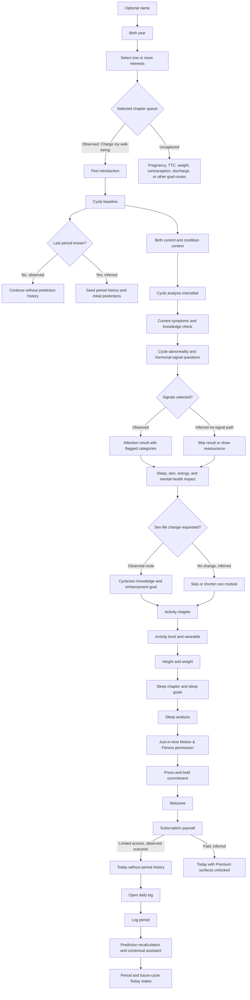

# Screenshot Onboarding Audit

Status: product-spec reconstruction from the 52 supplied screenshots  
Dataset: `IMG_7569.PNG` through `IMG_7627.PNG` in numeric capture order  
Source dimensions: 1206 × 2622 px, consistent with a 3× 402 × 874 pt iPhone canvas

This is an observational specification, not authorization to copy Flo’s branding,
illustrations, writing, medical claims, or trade dress. The useful material is the
information architecture, adaptive behavior, and interaction patterns.

## Executive finding

The capture contains 38 onboarding/monetization screens followed by 14 downstream
product screens. The onboarding is not a simple setup wizard. It is a modular
assessment funnel:

1. establish identity and interests;
2. introduce a mascot-led “Well-Being Battery” promise;
3. collect cycle, symptom, sex, activity, body-measurement, and sleep context;
4. periodically show “analysis” interstitials and personalized result copy;
5. ask for a native permission only after explaining the benefit;
6. use a commitment interaction and celebration;
7. present a subscription paywall;
8. immediately demonstrate how the answers affect Today, logging, predictions,
   insight cards, and the Health Assistant.

The capture follows the “Charge my well-being” route. Other goal-specific routes
were not captured and must not be assumed to have the same questions.

## Complete ordered screen inventory

| # | File | Screen | Input, state, or downstream result |
|---:|---|---|---|
| 1 | `IMG_7569.PNG` | Preferred name | Optional free-text entry; keyboard visible; Skip and Continue |
| 2 | `IMG_7570.PNG` | Personalized greeting | Transitional confirmation using inferred first name |
| 3 | `IMG_7571.PNG` | Birth year | Centered year wheel; 2007 selected |
| 4 | `IMG_7572.PNG` | Goals/interests | Multi-select card grid; eight interests visible |
| 5 | `IMG_7573.PNG` | Mascot introduction | Flori introduced as a Well-Being Battery |
| 6 | `IMG_7574.PNG` | Value proposition | Mascot promises reflection, tips, and insights |
| 7 | `IMG_7575.PNG` | Cycle chapter intro | Story-map interstitial; cycle is the first assessment chapter |
| 8 | `IMG_7576.PNG` | Period regularity | Yes selected; selected card expands with personalized benefit copy |
| 9 | `IMG_7578.PNG` | Last-period start | Full calendar selector plus “I don’t remember”; no date selected |
| 10 | `IMG_7579.PNG` | Birth-control method | Skippable single-choice list; seven methods visible |
| 11 | `IMG_7580.PNG` | Existing health conditions | Skippable multi-select; six conditions visible |
| 12 | `IMG_7581.PNG` | Cycle analysis | Animated interstitial, social-proof statistic, “Flo Intelligence” attribution |
| 13 | `IMG_7582.PNG` | Symptom chapter intro | Story-map transition from cycle to symptoms |
| 14 | `IMG_7583.PNG` | Symptoms today | Icon-grid multi-select; “None of these” is exclusive |
| 15 | `IMG_7584.PNG` | Discharge knowledge | Skippable Yes/No knowledge check |
| 16 | `IMG_7586.PNG` | Cycle abnormalities | Skippable multi-select; five signals visible |
| 17 | `IMG_7587.PNG` | Hormonal-imbalance signs | Skippable multi-select; five signs visible |
| 18 | `IMG_7588.PNG` | Symptom analysis | Animated interstitial with intelligence attribution |
| 19 | `IMG_7589.PNG` | Attention result | Flags “cycle abnormalities” and “hormonal imbalance” categories |
| 20 | `IMG_7590.PNG` | Cycle impact on sleep | No selected; selected card expands with tailored response |
| 21 | `IMG_7591.PNG` | Cycle impact on skin | Yes selected; selected card expands with tailored response |
| 22 | `IMG_7592.PNG` | Cycle impact on energy/activity | No selected; selected card expands with tailored response |
| 23 | `IMG_7593.PNG` | Cycle impact on mental health | Mood swings selected; explanatory copy expands inside selection |
| 24 | `IMG_7594.PNG` | Desired sex-life changes | Choice list; no selection visible |
| 25 | `IMG_7595.PNG` | Cycle/sex-life knowledge | No selected |
| 26 | `IMG_7597.PNG` | Sex-life goal | Choice list with privacy-preserving “Prefer not to answer” |
| 27 | `IMG_7599.PNG` | Activity chapter intro | Story-map transition; promises cycle-aware fitness patterns |
| 28 | `IMG_7601.PNG` | Typical activity level | “I try to get some active breaks in” selected |
| 29 | `IMG_7602.PNG` | Wearable brand | Fitbit selected |
| 30 | `IMG_7603.PNG` | Height | Dual wheel picker; 5 ft 2 in; metric toggle available |
| 31 | `IMG_7604.PNG` | Weight | Decimal wheel picker; 132.2 lb; kg toggle available |
| 32 | `IMG_7606.PNG` | Sleep chapter intro | Dark-violet story-map transition |
| 33 | `IMG_7607.PNG` | Sleep improvement goals | Explicit multi-select; “Waking up feeling more rested” selected |
| 34 | `IMG_7608.PNG` | Sleep analysis | Animated interstitial with intelligence attribution |
| 35 | `IMG_7609.PNG` | Motion & Fitness permission | Native iOS permission alert over a benefit-explanation screen |
| 36 | `IMG_7610.PNG` | Commitment | Personalized pledge; press-and-hold logo interaction |
| 37 | `IMG_7611.PNG` | Welcome | Full-bleed coral completion splash |
| 38 | `IMG_7612.PNG` | Subscription choice | Trial, yearly, family, more-plans, restore, and limited-access paths |
| 39 | `IMG_7613.PNG` | Today: no period history | Last-period empty state, three quick-log actions, insight rail, bottom tabs |
| 40 | `IMG_7614.PNG` | Daily log: sex/mood | Bottom-sheet logger with search and category-colored chips |
| 41 | `IMG_7615.PNG` | Daily log: mood/symptoms | Continuation of searchable logger |
| 42 | `IMG_7616.PNG` | Daily log: symptoms/discharge | Long symptom set and discharge variants |
| 43 | `IMG_7617.PNG` | Daily log: digestion/tests | Digestion, pregnancy tests, and ovulation tests |
| 44 | `IMG_7618.PNG` | Daily log: other/activity | Lifestyle events and exercise types |
| 45 | `IMG_7619.PNG` | Daily log: medication/water | Contraceptive pills, other pills, reminders, hydration |
| 46 | `IMG_7620.PNG` | Daily log: metrics/notes | Water settings, weight, basal temperature, notes |
| 47 | `IMG_7621.PNG` | Prediction update + assistant | Contextual Health Assistant sheet triggered by a newly logged period |
| 48 | `IMG_7622.PNG` | Today: period day 1 | Period hero, learning link, quick actions, state-specific insight cards |
| 49 | `IMG_7624.PNG` | Today: period day 2 | Tomorrow selected; date-specific symptoms and cycle-day cards |
| 50 | `IMG_7625.PNG` | Today: pre-fertile | Ovulation in 10 days, low-pregnancy-chance label, cycle day 6 |
| 51 | `IMG_7626.PNG` | Today: fertile approach | Ovulation in 3 days, teal theme, cycle day 13 |
| 52 | `IMG_7627.PNG` | Today: predicted ovulation | Most-fertile-day hero, teal theme, cycle day 16 |

## Question and answer taxonomy

### Identity and goal selection

| Field | Input model | Visible choices or behavior |
|---|---|---|
| Preferred name | Optional text | Skip available; greeting derives “Mann” from “Mann Bellani” |
| Birth year | Required-looking single wheel | Year values; 2007 selected |
| Interests/goals | Explicit multi-select | Get pregnant; already pregnant; track period; charge well-being; manage weight; enhance sex life; decode discharge; explore contraception |

The goal grid is interest-based rather than mutually exclusive. It likely controls which
chapters are added to the onboarding queue, while one reproductive state eventually
controls the primary Today mode.

### Cycle baseline

| Question | Cardinality | Visible answers |
|---|---|---|
| Are periods regular? | Single | Yes; No; I’m not sure |
| Last period start | Single date | Calendar day; I don’t remember |
| Birth control used | Single, skippable | Nothing; pill/patch/ring; progestin-only pill; implant/injection; hormonal IUD; copper IUD; condoms |
| Experienced health conditions | Multi, skippable | Yeast infections; UTIs; bacterial vaginosis; PCOS; endometriosis; fibroids |

The lists visibly continue below the viewport, so the screenshots do not prove that these
are the complete production option sets.

### Current symptoms and cycle signals

| Question | Cardinality | Visible answers |
|---|---|---|
| How do you feel today? | Multi | Cramps; fatigue; bloating; tender breasts; backache; none |
| Know that discharge changes? | Single | Yes; No |
| Cycle abnormalities | Multi | Unpredictable cycles; missed periods; heavy periods; spotting between periods; period shorter/longer than 2–7 days |
| Hormonal-imbalance signs | Multi | Acne/oily skin; excess facial/body hair; hair loss; unexplained weight gain/trouble losing; low libido |

The observed result groups the answers into two alert categories. It does not show a
condition diagnosis, but the language explicitly connects the signals with PCOS and
endometriosis and therefore behaves like a symptom-screening surface.

### Cross-domain cycle impact

| Domain | Cardinality | Visible answers/state |
|---|---|---|
| Sleep impact | Single | Yes; No; unsure; No selected |
| Skin impact | Single | Yes; No; unsure; Yes selected |
| Energy/activity impact | Single | Yes; No; unsure; No selected |
| Mental health impact | Likely multi | Mood swings; anxiety; fatigue; more below viewport; mood swings selected |

Selections are not just highlighted. The selected card becomes taller and injects a
domain-specific explanation and cross-sell for later content.

### Sex-life personalization

| Question | Cardinality | Visible answers |
|---|---|---|
| Want to change anything? | Not stated; appears single-choice | Better orgasms; improved sex drive; increased intimacy; sex positions; make sex less painful; nothing to change |
| Know how cycle relates to sex life? | Single | Yes; No; I don’t know |
| How to enhance sex life? | Not stated; appears single-choice | More connection; more orgasms; more fun; more confidence; prefer not to answer |

This module may feed premium sexual-wellness content or a Guided Journey. Exact skip
rules are not proven by the capture.

### Activity, body measurements, and sleep

| Field | Cardinality/input | Visible choices |
|---|---|---|
| Typical activity | Single | Not super active; some active breaks; on feet most of day; don’t track |
| Wearable | Single | None; Apple; Fitbit; Garmin; Other |
| Height | Numeric wheel | ft/in or cm |
| Weight | Decimal numeric wheel | lb or kg |
| Sleep goals | Explicit multi-select | Fall asleep faster; stay asleep; wake more rested; improve quality; improve bedtime routine |
| Motion & Fitness | Native permission | Don’t Allow; Allow |

### Commitment and monetization

| Field | Input | Visible choices |
|---|---|---|
| Commitment acknowledgement | Press and hold | Personalized pledge; radial progress implied |
| Subscription | Single plan/exit | Free trial; yearly plan; family plan; view all; restore; limited access |

The displayed prices are a point-in-time paywall experiment, not stable design tokens.

## Inferred adaptive branch graph

### Branch confidence

Observed directly:

- selected answer cards expand with personalized copy;
- unknown last-period state reaches a post-paywall empty Today screen;
- a newly logged period triggers prediction recalculation, an assistant prompt, period
  day states, and future ovulation states;
- activity, body measurements, and sleep follow the selected well-being route;
- limited access exists as a paywall exit.

Strongly inferred:

- selected goals enqueue or suppress assessment chapters;
- known last-period input seeds prediction history;
- selected symptom clusters determine the attention-result categories;
- “nothing to change” likely shortens the sex-life branch;
- wearable choice controls later integration prompts.

Not publicly proven by this dataset:

- the exact ordering and exclusivity rules when multiple goals are selected;
- the full pregnancy, TTC, weight, discharge, contraception, or perimenopause routes;
- whether height and weight are universal or goal-conditioned;
- whether a no-signal symptom response produces reassurance or silently skips results;
- which answer caused the native Motion & Fitness prompt;
- paid versus limited-access differences after the paywall beyond the visible screens.

## Collected and inferred data model

### Explicit onboarding fields

| Field | Type | Optionality visible | Downstream use inferred or shown |
|---|---|---|---|
| `preferredName` | string | Skippable | Greeting, pledge, personalized questions |
| `birthYear` | integer | Appears required | Age-aware predictions/content |
| `selectedGoals` | string array | Multi-select | Assessment chapter queue and content targeting |
| `periodRegularitySelfReport` | yes/no/unsure | Skippable | Period expectations and cycle analysis |
| `lastPeriodStart` | date/null | Unknown allowed | Cycle day and period/ovulation predictions |
| `birthControlMethod` | enum/null | Skippable | Prediction behavior, reminders, contraception content |
| `healthConditions` | enum array | Skippable | Content/safety targeting |
| `currentSymptoms` | enum array | Skippable | Symptom insights and analysis |
| `knowsDischargeChanges` | boolean/null | Skippable | Educational targeting |
| `cycleAbnormalitySignals` | enum array | Skippable | Attention-result category |
| `hormonalSignals` | enum array | Skippable | Attention-result category |
| `cycleSleepImpact` | yes/no/unsure | Skippable | Sleep content personalization |
| `cycleSkinImpact` | yes/no/unsure | Skippable | Skin content personalization |
| `cycleEnergyImpact` | yes/no/unsure | Skippable | Fitness content personalization |
| `cycleMentalHealthImpact` | enum array | Skippable | Mood content and tracking prompts |
| `sexLifeChangeGoal` | enum/null | Skippable | Sexual-wellness content |
| `cycleSexKnowledge` | yes/no/unsure | Skippable | Educational depth |
| `sexLifeEnhancementGoal` | enum/null | Prefer-not available | Sexual-wellness content |
| `activityLevel` | enum/null | Skippable | Fitness recommendations |
| `wearableBrand` | enum/null | Skippable | Integration route |
| `height` and `heightUnit` | numeric + enum | Skippable | Claimed prediction/personalization input |
| `weight` and `weightUnit` | numeric + enum | Skippable | Claimed prediction/personalization input |
| `sleepGoals` | enum array | Not visibly skippable on captured frame | Sleep guidance |
| `motionFitnessAuthorization` | OS permission state | User controlled | Step/activity import |
| `commitmentCompleted` | boolean/timestamp | Interaction required-looking | Funnel completion marker |
| `subscriptionChoice` | plan/trial/limited | Limited access available | Entitlement |

### Derived values and behavior shown

- first-name extraction from preferred name;
- chapter and question ordering;
- cycle and symptom “analysis” states;
- flagged symptom categories;
- personalized response copy inside selected cards;
- cycle day and period day;
- predicted period, fertile window, and ovulation day;
- daily pregnancy-chance label;
- date-specific “symptoms to expect”;
- contextual Health Assistant trigger for a new cycle;
- paid-content recommendations and paywall context.

## Every downstream surface visible

### Today shell

- profile/mascot entry point;
- centered selected date and seven-day strip;
- calendar button;
- state-colored hero:
  - no-history neutral peach;
  - period pink;
  - fertile/ovulation teal;
- primary state label and optional explanatory sublabel;
- three quick actions: log/edit period, symptoms, sex;
- horizontal daily-insight rail;
- fixed five-tab navigation: Today, Clinic, Insights, Secret Chats, Messages.

### Visible insight-card types

- coping with pregnancy anxiety/paranoia;
- PMS versus pregnancy;
- reasons to log a period;
- today’s chance of pregnancy;
- foods that may relieve period pain;
- date-specific symptoms to expect;
- cycle-day card;
- updating/loading state.

### Daily log bottom sheet

Common structure:

- drag handle;
- previous/next date arrows;
- centered date title;
- search;
- stacked white category cards;
- category-colored icon chips;
- edit/delete controls for numeric trackers.

Visible logging taxonomy:

- Sex and drive: no sex, protected/unprotected, oral, anal, masturbation, sensual
  touch, sex toys, orgasm, high/neutral/low drive.
- Mood: calm, happy, energetic, frisky, mood swings, irritated, sad, anxious,
  depressed, guilty, obsessive thoughts, low energy, apathetic, confused,
  very self-critical.
- Symptoms: everything fine, cramps, tender breasts, headache, acne, backache,
  fatigue, cravings, insomnia, abdominal pain, vaginal itching/dryness, hot flashes,
  night sweats.
- Discharge: none, creamy, watery, sticky, egg white, spotting, unusual, clumpy
  white, gray.
- Digestion/stool: nausea, bloating, constipation, diarrhea.
- Pregnancy test: not taken, positive, negative, faint line.
- Ovulation: tutorial/log action, not taken, “my method.”
- Other/lifestyle: travel, stress, meditation, journaling, Kegel exercises,
  breathing exercises, disease/injury, alcohol.
- Physical activity: did not exercise, yoga, gym, aerobics/dancing, swimming,
  team sports, running, cycling, walking.
- Medication: oral contraceptive taken on time, yesterday’s pill, other pill,
  reminders.
- Measurements: water, weight, basal temperature.
- Free text: notes.

### Contextual Health Assistant

- appears as a dismissible bottom card during prediction recalculation;
- includes duration/progress metadata;
- explains the detected event;
- offers a direct “Start the chat” action;
- uses the newly logged period as context.

### Time-travel states

- day 1 and day 2 of a logged period;
- tomorrow/future-date browsing;
- ovulation in 10 days;
- ovulation in 3 days;
- predicted ovulation day;
- dynamic pregnancy-chance, symptom, and cycle-day cards.

## UI design system reconstructed from the screenshots

Approximate values are implementation guidance, not extracted brand assets.

### Visual tokens

| Token | Approximate value/use |
|---|---|
| Canvas | 402 × 874 pt logical mobile canvas |
| Brand coral | `#ff5b7d`–`#ff6281`; logo, CTAs, progress, active quick actions |
| Selected rose | `#ec607b`; filled answer cards |
| Pale blush | `#fff0f8`; assessment and story-map backgrounds |
| Neutral option | `#f3f3f3`; inactive choice cards and search |
| Surface | `#ffffff`; sheets, speech bubbles, option panels |
| Ink | near `#090909`; headings and high-priority labels |
| Muted ink | `#66666c`; helper text and inactive controls |
| Sleep aubergine | near `#302052`; sleep chapter atmosphere |
| Period wash | pale pink `#fbd6e2` family |
| Fertile wash | pale aqua `#c9eff0` family |
| Neutral-cycle wash | pale peach `#f8e7df` family |
| Warning | amber `#f5a900`; attention markers |
| Primary heading | bold rounded sans, approximately 28–32 pt, 750–850 weight |
| Body | rounded sans, approximately 14–17 pt |
| Helper/label | 11–14 pt, muted |
| Primary CTA | 50–56 pt high, pill radius, bold white label |
| Choice row | usually 54–72 pt high, 10–14 pt radius |
| Horizontal margin | usually 16–24 pt |
| Vertical rhythm | 8, 12, 16, 24, and 32 pt increments |

### Repeated patterns

1. **Progressive disclosure:** one question per screen; long option sets scroll.
2. **Back + progress + Skip:** thin progress bar without a numerical step count.
3. **Selected-card expansion:** selection changes color and reveals response copy.
4. **Mascot continuity:** the same character teaches, analyzes, celebrates, and links
   otherwise unrelated chapters.
5. **Chapter maps:** benefits are explained before more questions; future steps are shown
   as locked nodes.
6. **Analysis theater:** a brief animated pause separates data collection from a result,
   increasing the perceived value of personalization.
7. **Just-in-time permissions:** native permission appears after an explanation of why
   activity data is useful.
8. **Mixed CTA widths:** compact centered pills on choice screens; near-full-width CTAs
   on numeric pickers and paywalls.
9. **Centered questions, left-aligned answers:** prompts feel conversational while option
   lists stay scannable.
10. **State-colored Today canvas:** reproductive state changes the entire atmosphere, not
    merely an icon or badge.
11. **Horizontal insight rail:** the current state is decomposed into small, tappable
    content and metric cards.
12. **Sheet-based dense logging:** a separate neutral sheet contains the high-density
    tracker catalog, preserving a calmer Today screen.
13. **Commitment + celebration + paywall:** motivation is deliberately raised immediately
    before subscription choice.

### Accessibility and trust observations

- inactive and disabled text sometimes has low contrast;
- selection meaning depends heavily on color;
- analysis screens do not explain what is calculated or what data is retained;
- health-condition and symptom questions can feel diagnostic;
- claims connecting height/weight/activity to prediction quality need transparent evidence;
- the native permission prompt is well timed, but health-data consent and content
  personalization consent are not separately visible;
- the paywall uses a preselected yearly plan and visually de-emphasizes limited access.

## Comparison with current Periodus onboarding

Current Periodus flow:

1. privacy-first welcome;
2. single primary goal;
3. birth year;
4. last-period date;
5. typical cycle length;
6. optional OpenAI/Anthropic/Ollama configuration;
7. medical disclaimer and finish.

| Area | Screenshot flow | Current Periodus | Gap or deliberate difference |
|---|---|---|---|
| Identity | Optional name + personalized greeting | No name | Missing optional personalization |
| Goals | Multi-interest grid; likely adaptive chapter queue | One mutually exclusive goal | Periodus cannot express secondary interests |
| Reproductive modes | Captured route is well-being; other routes not shown | Cycle, TTC, pregnancy, perimenopause | Periodus has an explicit peri mode advantage |
| Cycle baseline | Regularity, LMP, contraception, conditions | LMP + explicit typical cycle length | Periodus is simpler but lacks important context |
| Symptoms | Current symptoms and two signal screens | None during onboarding | No tracker personalization or baseline |
| Cross-domain impact | Sleep, skin, energy, mental health | None | Missing preference capture |
| Sexual wellness | Intent, knowledge, desired outcome | None | Deliberately avoid if Guided Journey remains excluded |
| Lifestyle | Activity level, wearable, height, weight | None | Missing import/personalization setup |
| Sleep | Goals + analysis | None | Missing preferences |
| Permissions | Just-in-time Motion & Fitness request | Health integration lives in Settings | Periodus has less onboarding friction but weaker discovery |
| AI | Proprietary “Intelligence” and assistant presented as benefit | Technical provider/model/key setup | Periodus is transparent but too implementation-oriented for a general-user funnel |
| Feedback | Multiple analysis and personalized-result screens | No intermediate payoff | Periodus feels like a form rather than a responsive conversation |
| Completion | Press-and-hold pledge + celebration | Read-and-confirm medical disclaimer | Periodus is safer and clearer, but less emotionally memorable |
| Monetization | Trial/yearly/family paywall + limited access | No subscription | Deliberate business-model difference |
| Visual language | Bold sans, mascot, blush maps, stateful cards | Terminal Modernist (Dark gold obsidian) | Preserve Periodus identity; borrow interaction structure only |
| Progress | Long modular flow with Skip on most sensitive questions | Fixed five-step setup header, excluding welcome and finish | Accurate for today’s linear flow, but not branch-aware |

### Periodus data-model readiness

Already persisted by onboarding:

- one primary `goal`;
- `birthYear`;
- pregnancy or cycle `lastPeriod`;
- estimated `cycleLength`;
- AI provider/model/base URL and secure API key.

Missing persistent onboarding fields:

- optional name;
- secondary interests;
- period regularity self-report;
- contraception method;
- baseline conditions;
- personalization preferences for symptoms, sleep, movement, and content;
- wearable brand;
- height;
- sleep goals;
- onboarding permission and consent states.

The existing daily-log taxonomy already covers many downstream tracker concepts:
symptoms, moods, discharge, sex, sleep, movement, wellbeing, contraception, care,
BBT, OPK, weight, water, steps, and notes. Notable visible gaps are the richer sex-event
set, pregnancy-test outcomes, several discharge variants, a height field, wearable
preference, and medication schedules.

## Recommended incorporation boundary

High-value, in-scope patterns to adapt:

1. optional name and a lightweight personalized greeting;
2. one primary mode plus secondary interests;
3. goal-conditioned chapters instead of one fixed sequence;
4. period regularity and contraception context;
5. a short, non-diagnostic “what would you like to track?” baseline;
6. selected-card explanations that immediately show why an answer matters;
7. chapter transitions using Periodus’s original design language;
8. just-in-time HealthKit/Health Connect education and permission;
9. a personalized setup summary before entering Today;
10. branch-aware progress and universal Skip/Prefer-not options;
11. keep AI setup optional, but move technical model/base-URL controls to Settings.

Explicitly excluded or unsafe to reproduce:

- PCOS/endometriosis or perimenopause symptom checking without a clinically validated,
  independently reviewed instrument;
- diagnostic-sounding “we detected” results;
- the Guided Journey and its orgasm-focused funnel if it remains out of scope;
- Secret Chats, community, Messages, and partner-sharing surfaces;
- Flo’s mascot, logo, illustrations, exact copy, paywall trade dress, or proprietary
  “Intelligence” claims.

The correct Periodus translation is a shorter, calmer, privacy-forward adaptive setup—not
a screen-for-screen clone.
